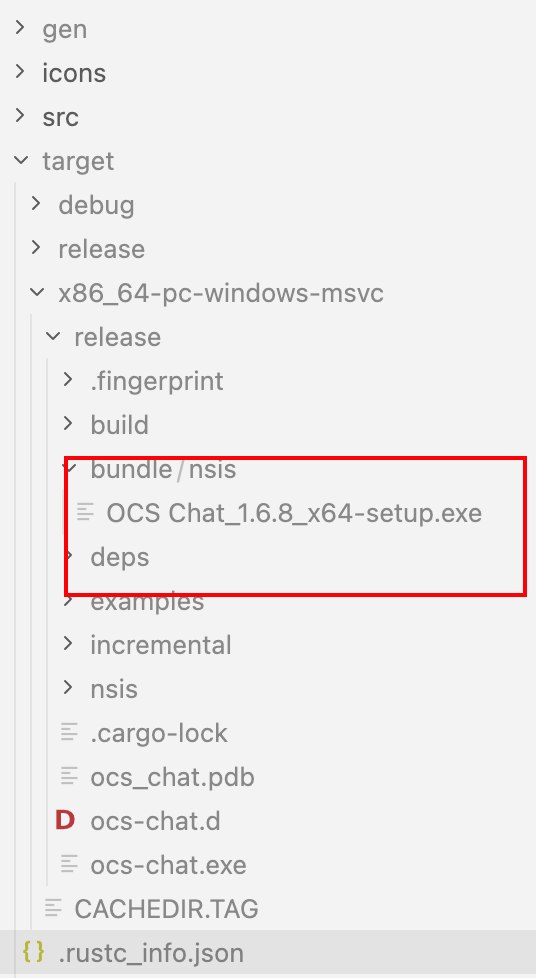
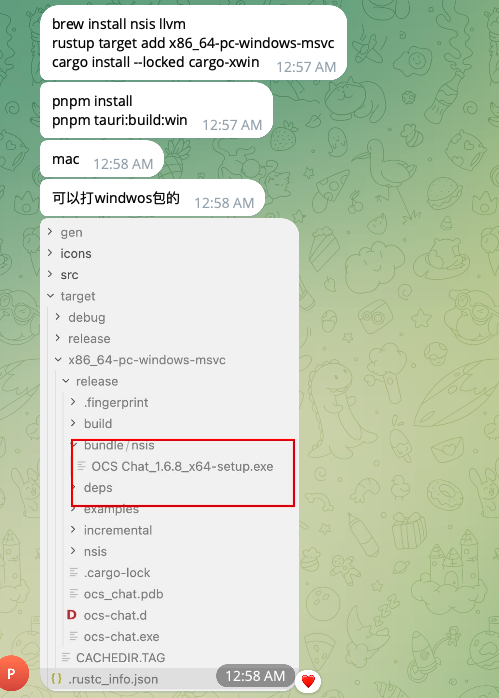

mac打包：pnpm release:dist:mac:pkgs或者pnpm release:dist:mac:universal
本地启动：nvm use 20 && pnpm tauri:dev
打开开发者工具：Control + Shift + I
mac打包：
    pnpm release:dist:mac:test（测试环境）
    pnpm release:dist:mac:test 97|45|55（测试环境【单个包】）
    pnpm release:dist:mac:uat（预发环境 uat）
    pnpm release:dist:mac:uat 97|45|55（预发环境 uat 单个包）
    pnpm release:dist:mac:prod（生产环境）
    pnpm release:dist:mac:prod 97｜45｜55（生产环境 prod 单个包）
    

win打包：
    pnpm release:dist:win:test（测试环境）
    pnpm release:dist:win:test 97|45|55（测试环境【单个包】）
    pnpm release:dist:win:uat（预发环境 uat）
    pnpm release:dist:win:uat 97|45|55（预发环境 uat 单个包）
    pnpm release:dist:win:prod（生产环境）
    pnpm release:dist:win:prod 97|45|55（生产环境 prod 单个包）

环境变量：现在测试都是169

批量品牌 mac 测试 pkg：pnpm release:dist:mac:pkgs:test
单品牌 mac 测试 pkg：bash ./scripts/build-release-brand.sh 97 mac test

Windows打包：
    打包命令：
        pnpm install
        pnpm tauri:build:win
    第一次配置环境：
        pnpm tauri:setup:win
            也可以手动配置：
                brew install nsis llvm
                rustup target add x86_64-pc-windows-msvc
                cargo install --locked cargo-xwin
视频解析地址：
    gyan.dev

打包用这个命令：pnpm release:dist:mac:universal或者pnpm release:dist:mac:pkgs

本地启动app：nvm use 20 && pnpm tauri:dev
打开开发者工具：Control + Shift + I

打windows 包：
第一次配置环境：
pnpm tauri:setup:win
·
手动配置也可以：
brew install nsis llvm
rustup target add x86_64-pc-windows-msvc
cargo install --locked cargo-xwin

打包：
pnpm install
pnpm tauri:build:win

视频解析地址：gyan.dev

